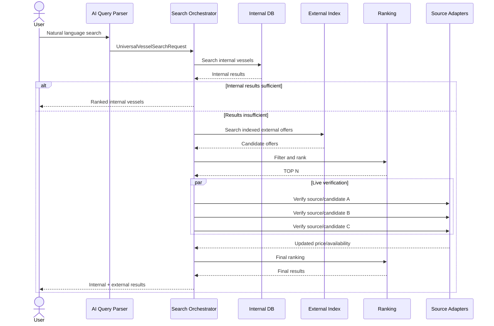

# AI Federated Vessel Search Architecture v1.0

## 1. Назначение документа

Документ определяет обновлённую архитектуру поиска яхт и морских судов для аренды в проекте. Основная задача — обеспечить быстрый унифицированный поиск по внутреннему каталогу платформы и внешним charter-источникам, несмотря на различия API, HTML-структуры, поисковых форм, терминологии и моделей данных внешних сайтов.

Ключевой принцип архитектуры:

**Internal First → External Index → Live Verification → Contact / Booking Intent**

ИИ используется для понимания пользовательского запроса, нормализации сложных данных, семантического ранжирования и генерации коммуникации, но не должен выполнять полный просмотр всех внешних сайтов при каждом поиске.

---

## 2. Цели

Система должна:

- принимать запрос пользователя в свободной форме или через форму поиска;
- поддерживать как минимум параметры `дата`, `место`, `цена`;
- выполнять поиск сначала среди зарегистрированных на платформе судов;
- при недостатке внутренних результатов использовать внешний поисковый индекс;
- подключать различные внешние сайты через независимые адаптеры;
- приводить данные разных источников к единой канонической модели;
- выполнять live-проверку только наиболее подходящих внешних кандидатов;
- ранжировать результаты по релевантности;
- различать подтверждённую и предполагаемую доступность;
- для внутренних судов предоставлять собственный процесс контакта/бронирования;
- для внешних судов предоставлять переход к источнику или создавать Contact/Booking Intent;
- при необходимости генерировать сообщение владельцу или поставщику услуги;
- позволять подключать новые источники без изменения основной логики Search Service.

---

## 3. Основная проблема внешнего поиска

Сайты аренды судов имеют различные:

- пользовательские интерфейсы;
- URL и параметры поиска;
- API и GraphQL интерфейсы;
- HTML-структуры;
- названия типов судов;
- форматы цены;
- модели availability;
- форматы местоположения;
- способы контакта и бронирования.

Поэтому основной системе не следует работать непосредственно с интерфейсом конкретного сайта.

Вместо этого вводятся:

1. `UniversalVesselSearchRequest`;
2. `UniversalVesselOffer`;
3. `SourceProfile`;
4. `SourceAdapter`;
5. `External Vessel Index`;
6. `Search Orchestrator`.

---

## 4. Общая архитектура

```text
User
  │
  ▼
AI Query Parser
  │
  ▼
UniversalVesselSearchRequest
  │
  ▼
Search Orchestrator
  │
  ├──────────────► Internal Search
  │                     │
  │                     ▼
  │               Internal Results
  │
  └──────────────► External Index Search
                        │
                        ▼
                    Candidates
                        │
                        ▼
                 Filter + Ranking
                        │
                        ▼
                      TOP N
                        │
                        ▼
                 Live Verification
                        │
             ┌──────────┼──────────┐
             ▼          ▼          ▼
          Source A   Source B   Source C
          Adapter    Adapter    Adapter
             │          │          │
             └──────────┼──────────┘
                        ▼
               UniversalVesselOffer[]
                        │
                        ▼
                  Deduplication
                        │
                        ▼
                    Final Rank
                        │
                        ▼
                    Search Result
                  ┌─────┴─────┐
                  ▼           ▼
               Internal     External
                  │           │
                  ▼           ▼
              Booking     Contact Intent
```

---

## 5. UniversalVesselSearchRequest

Все запросы независимо от источника преобразуются в единую внутреннюю модель.

Минимальные параметры:

```text
WHERE   → location
WHEN    → dateFrom / dateTo
BUDGET  → price
```

Расширенная модель:

```text
UniversalVesselSearchRequest
 ├── location
 │    ├── country
 │    ├── region
 │    ├── city
 │    ├── marina
 │    ├── latitude
 │    └── longitude
 ├── dateFrom
 ├── dateTo
 ├── priceMin
 ├── priceMax
 ├── currency
 ├── priceUnit
 ├── vesselTypes[]
 ├── guests
 ├── cabins
 ├── lengthMin
 ├── lengthMax
 ├── crewType
 ├── captainRequired
 ├── amenities[]
 ├── activities[]
 └── searchRadiusKm
```

Пример:

```json
{
  "location": {
    "country": "Greece"
  },
  "dateFrom": "2027-07-10",
  "dateTo": "2027-07-17",
  "priceMax": 7000,
  "currency": "EUR",
  "guests": 6,
  "vesselTypes": ["SAILING_YACHT"]
}
```

---

## 6. AI Query Parser

ИИ используется для преобразования естественного языка пользователя в `UniversalVesselSearchRequest`.

Пример запроса:

> Хочу яхту в Греции с 10 по 17 июля примерно до 7000 евро, нас шестеро, желательно парусную.

Поток:

```text
Natural Language
       │
       ▼
AI Query Parser
       │
       ▼
UniversalVesselSearchRequest
```

После получения структурированного запроса дальнейшая фильтрация должна преимущественно выполняться обычным программным кодом и БД, а не LLM.

---

## 7. Canonical Vocabulary

Разные источники могут использовать разные названия одного понятия.

Например:

```text
Sailboat       ─┐
Sailing        ─┼──► SAILING_YACHT
Sailing Yacht  ─┘
```

Рекомендуемый базовый справочник типов:

```text
MOTOR_YACHT
SAILING_YACHT
CATAMARAN
TRIMARAN
SUPERYACHT
EXPEDITION_YACHT
MOTOR_BOAT
SAILING_BOAT
OTHER
```

Нормализация также требуется для:

- location;
- currency;
- price unit;
- capacity;
- cabins;
- crew;
- amenities;
- availability;
- vessel type.

---

## 8. Source Registry и SourceProfile

Каждый внешний источник регистрируется в системе отдельно.

`SourceProfile` должен описывать возможности источника, а не только его URL.

Пример:

```yaml
source:
  id: example-source
  domain: example.com
  enabled: true
  priority: 80

  capabilities:
    search: true
    details: true
    availability: true
    pricing: true
    contact: true

  access:
    type: API

  search:
    location: true
    dates: true
    price: true
    guests: true

  extraction:
    strategy: API
```

Поддерживаемые стратегии:

```text
API
GRAPHQL
STRUCTURED_DATA
SEARCH_URL
WEB_PARSER
AI_EXTRACTION
```

Рекомендуемый приоритет:

```text
API
 ↓
GraphQL
 ↓
Structured Data
 ↓
Known Search URL / Endpoint
 ↓
HTML Parser
 ↓
AI Extraction
```

`AI_EXTRACTION` является fallback-механизмом, а не основным способом поиска.

---

## 9. Source Coverage

Система должна заранее знать географическую применимость источника.

Пример:

```json
{
  "coverage": {
    "worldwide": false,
    "countries": ["EE", "FI", "SE"],
    "regions": ["BALTIC"]
  }
}
```

Возможная модель:

```text
SourceCoverage
 ├── sourceId
 ├── country
 ├── region
 ├── destination
 ├── latitude
 ├── longitude
 └── radiusKm
```

Перед обращением к внешнему источнику Search Orchestrator проверяет его coverage и capabilities. Источники, не поддерживающие требуемый регион или параметры, исключаются из запроса.

---

## 10. SourceAdapter

Основная система не должна знать внутреннюю структуру внешнего сайта.

Единый контракт:

```java
public interface VesselSourceAdapter {

    boolean supports(SearchRequest request);

    SearchResponse search(SearchRequest request);

    VesselDetails getDetails(String externalId);

    AvailabilityResult checkAvailability(
        String externalId,
        LocalDate from,
        LocalDate to
    );

    ContactCapability getContactCapability();
}
```

Примеры реализаций:

```text
InternalVesselAdapter
CharterIndexAdapter
SailicaAdapter
BrilionsAdapter
OtherProviderAdapter
```

При изменении внешнего сайта изменяется его адаптер, а не Search Service.

---

## 11. UniversalVesselOffer

Все ответы источников нормализуются в единую модель.

```text
UniversalVesselOffer
 ├── sourceId
 ├── externalId
 ├── internalVesselId
 ├── name
 ├── vesselType
 ├── location
 ├── price
 ├── currency
 ├── priceUnit
 ├── capacity
 ├── cabins
 ├── length
 ├── availabilityStatus
 ├── sourceUrl
 ├── contactCapability
 ├── indexedAt
 ├── verifiedAt
 └── confidence
```

Пример:

```json
{
  "sourceId": "external-provider",
  "externalId": "abc-123",
  "name": "Bavaria Cruiser 36",
  "vesselType": "SAILING_YACHT",
  "location": {
    "city": "Tallinn",
    "country": "EE"
  },
  "price": 520,
  "currency": "EUR",
  "priceUnit": "DAY",
  "capacity": 8,
  "availabilityStatus": "VERIFIED",
  "sourceUrl": "...",
  "confidence": "HIGH"
}
```

---

## 12. External Vessel Index

Для ускорения пользовательского поиска внешние данные следует индексировать заранее, когда это разрешено условиями источника и техническим способом доступа.

```text
External Sources
      │
      ▼
Data Collection
      │
      ▼
Normalization
      │
      ▼
Deduplication
      │
      ▼
External Vessel Index
```

Минимальная индексируемая модель:

```text
ExternalVesselIndex
 ├── id
 ├── sourceId
 ├── externalId
 ├── name
 ├── vesselType
 ├── country
 ├── region
 ├── location
 ├── latitude
 ├── longitude
 ├── priceFrom
 ├── priceTo
 ├── currency
 ├── priceUnit
 ├── capacity
 ├── cabins
 ├── availableFrom
 ├── availableTo
 ├── sourceUrl
 └── lastCheckedAt
```

External Index не является гарантией текущей доступности. Он предназначен прежде всего для быстрого поиска кандидатов.

---

## 13. Двухфазный внешний поиск

### Phase 1 — Candidate Search

```text
UniversalVesselSearchRequest
        │
        ├──► Internal DB
        │
        └──► External Index
                 │
                 ▼
             Candidates
                 │
                 ▼
          Rules + Filtering
                 │
                 ▼
              Ranking
                 │
                 ▼
               TOP N
```

Фильтрация выполняется по строгим параметрам:

- место;
- даты;
- цена;
- capacity;
- обязательные характеристики.

### Phase 2 — Live Verification

Live-запрос выполняется только для лучших кандидатов.

```text
TOP N
 │
 ├──► Source A Adapter
 ├──► Source B Adapter
 ├──► Source C Adapter
 └──► Source D Adapter
```

Запросы выполняются параллельно с timeout и ограничением concurrency.

Проверяются прежде всего:

- актуальная цена;
- availability;
- актуальность объявления;
- URL;
- возможность контакта/бронирования.

---

## 14. Internal First Strategy

Приоритет остаётся за внутренним каталогом.

```text
Search Request
      │
      ▼
Internal Search
      │
      ├── sufficient results ──► Show Internal Results
      │
      └── insufficient results
                    │
                    ▼
              External Index
```

Вводится параметр:

```text
MIN_INTERNAL_RESULTS
```

Например:

```text
MIN_INTERNAL_RESULTS = 3
```

Если внутренних результатов достаточно, внешний поиск может не запускаться автоматически. Пользователь при этом может выбрать расширенный поиск по внешним источникам.

---

## 15. Availability и Freshness

Необходимо строго различать наличие объявления и подтверждённую доступность.

Статусы:

```text
VERIFIED
LIKELY_AVAILABLE
UNKNOWN
UNAVAILABLE
```

Дополнительно:

```text
DataConfidence
 ├── HIGH
 ├── MEDIUM
 └── LOW
```

Пример индексированного результата:

```json
{
  "price": 5200,
  "currency": "EUR",
  "availabilityStatus": "UNKNOWN",
  "indexedAt": "2026-08-28T04:00:00Z",
  "verifiedAt": null
}
```

После live verification:

```json
{
  "price": 5400,
  "currency": "EUR",
  "availabilityStatus": "VERIFIED",
  "verifiedAt": "2026-08-28T06:31:22Z"
}
```

Пользователю нельзя представлять устаревшую индексированную информацию как подтверждённую текущую доступность.

---

## 16. Ranking

Сначала применяются строгие фильтры, затем ranking.

Пример:

```text
Score =
    Location Match
  + Price Match
  + Availability Confidence
  + Vessel Match
  + User Preferences
  + Source Confidence
  + Data Freshness
```

AI ranking применяется преимущественно для semantic preferences, например:

> тихая семейная яхта для недельного отдыха с детьми

Строгие условия (`price <= maxPrice`, даты, capacity) должны проверяться детерминированно.

---

## 17. Deduplication

Одно судно может присутствовать на нескольких площадках.

Для определения дубликатов используются:

- name;
- manufacturer/model;
- year;
- location;
- dimensions;
- owner/provider;
- изображения/их идентификаторы, если допустимо;
- другие устойчивые характеристики.

Пример:

```text
Bavaria Cruiser 36
Bavaria 36 Cruiser
Bavaria CR36
```

могут быть объединены в одну logical vessel entity с несколькими предложениями/источниками.

---

## 18. Где используется AI

ИИ рекомендуется использовать для:

1. Natural Language → `UniversalVesselSearchRequest`;
2. анализа неизвестной структуры нового источника;
3. извлечения данных из сложной страницы как fallback;
4. mapping нестандартных полей к Canonical Model;
5. semantic ranking;
6. deduplication сложных случаев;
7. генерации сообщения владельцу/провайдеру.

ИИ не должен использоваться как основной механизм для:

- последовательного просмотра всех сайтов при каждом запросе;
- обычной фильтрации цены;
- сравнения дат;
- проверки capacity;
- работы с известным API;
- работы с уже известной HTML-структурой;
- стандартной сортировки и пагинации.

---

## 19. Подключение нового сайта

Новый источник проходит отдельный onboarding.

```text
New Source URL
      │
      ▼
Source Analyzer
      │
      ├── robots / access policy
      ├── sitemap discovery
      ├── API detection
      ├── GraphQL detection
      ├── structured data detection
      ├── search URL analysis
      ├── HTML structure analysis
      └── AI structure analysis
      │
      ▼
Generated SourceProfile
      │
      ▼
Administrator Validation
      │
      ▼
SourceAdapter / Mapping
      │
      ▼
ACTIVE
```

ИИ анализирует сайт преимущественно на этапе подключения или при обнаружении изменения структуры, а не заново при каждом пользовательском запросе.

---

## 20. Contact Intent и Booking Intent

Внешний результат не должен автоматически считаться внутренним объектом бронирования.

Для него создаётся:

```text
ContactIntent
```

или:

```text
BookingIntent
```

Пример:

```json
{
  "userId": 123,
  "sourceId": "external-provider",
  "externalVesselId": "EXT-8833",
  "type": "BOOKING_REQUEST",
  "dateFrom": "2026-09-12",
  "dateTo": "2026-09-15",
  "status": "DRAFT"
}
```

Дальнейшие действия зависят от `ContactCapability` источника:

```text
EMAIL
PROVIDER_API
CONTACT_FORM
EXTERNAL_BOOKING_URL
PLATFORM_MESSAGE
REDIRECT_ONLY
```

Перед отправкой сообщения пользователь должен подтвердить его.

---

## 21. Sequence Diagram



---

## 22. Производительность

Основные требования к производительности:

- не выполнять полный web crawl в пользовательском request path;
- использовать предварительный External Index;
- выполнять строгую фильтрацию в БД/поисковом индексе;
- выполнять live verification только для `TOP N`;
- выполнять запросы к независимым источникам параллельно;
- задавать timeout для каждого SourceAdapter;
- использовать circuit breaker для нестабильных источников;
- кешировать редко изменяющиеся vessel details;
- задавать TTL отдельно для price, availability и vessel metadata;
- не блокировать весь поиск из-за ошибки одного внешнего источника.

Пример:

```text
Search Orchestrator
     │
     ├── Source A ── 700 ms
     ├── Source B ── 1.2 sec
     ├── Source C ── timeout
     └── Source D ── 900 ms

Result returned without waiting indefinitely for Source C.
```

---

## 23. Отказоустойчивость

Каждый источник рассматривается как независимая внешняя зависимость.

Необходимы:

```text
Timeout
Retry with limits
Circuit Breaker
Rate Limiting
Source Health Status
Last Successful Access
Error Metrics
Fallback to indexed data
```

Ошибка одного сайта не должна приводить к ошибке всего поиска.

---

## 24. Безопасность и ограничения

При работе с внешними источниками необходимо учитывать:

- robots.txt;
- Terms of Service источника;
- ограничения API;
- rate limits;
- требования к attribution;
- ограничения на кеширование и хранение внешних данных;
- персональные данные владельцев;
- запрет на обход authentication/access controls;
- необходимость показывать источник внешней информации.

`SourceProfile` рекомендуется дополнить политикой:

```text
AccessPolicy
CachePolicy
AttributionPolicy
RateLimitPolicy
DataRetentionPolicy
```

---

## 25. Рекомендуемые сервисы

```text
AI Search Assistant
       │
       ├── Query Parser
       │
       ├── Search Orchestrator
       │      ├── Internal Search
       │      └── External Index Search
       │
       ├── Source Registry
       │
       ├── Source Adapter Layer
       │      ├── API Adapter
       │      ├── GraphQL Adapter
       │      ├── Parser Adapter
       │      └── AI Extraction Adapter
       │
       ├── Normalization Service
       ├── Deduplication Service
       ├── Ranking Service
       ├── Live Verification Service
       ├── Contact Intent Service
       └── Messaging Service
```

На начальном этапе эти компоненты не обязательно должны быть отдельными микросервисами. Они могут быть модулями одного backend-приложения с чёткими интерфейсами между ними.

---

## 26. Итоговый алгоритм поиска

```text
1. Receive user request

2. AI parses natural language
        ↓
   UniversalVesselSearchRequest

3. Validate / normalize request

4. Search INTERNAL inventory

5. Filter internal results

6. IF internal results >= MIN_INTERNAL_RESULTS
       rank
       return internal results
   ELSE
       continue

7. Search EXTERNAL INDEX

8. Apply strict filters

9. Merge internal + external candidates

10. Deduplicate

11. Rank candidates

12. Select TOP N external candidates

13. Determine required SourceAdapters

14. Live verification in parallel

15. Update:
       price
       availability
       freshness
       confidence

16. Remove unavailable/invalid candidates

17. Final ranking

18. Return results

19. IF selected vessel is INTERNAL
       → Contact / Booking

20. IF selected vessel is EXTERNAL
       → External link
       OR ContactIntent
       OR BookingIntent

21. AI generates message if required

22. User confirms

23. Send / redirect / initiate provider workflow
```

---

## 27. Архитектурный принцип проекта

Финальная концепция определяется как:

**AI-assisted Federated Vessel Search Engine**

```text
AI understands intent
        ↓
Canonical Search Model
        ↓
Deterministic Search Engine
        ↓
Internal + Indexed External Data
        ↓
Source Adapters
        ↓
Live Verification
        ↓
Normalized Results
        ↓
AI-assisted Ranking
        ↓
Booking / Contact Intent
```

Основная ценность подхода заключается в том, что AI применяется там, где действительно требуется понимание неструктурированной информации, а операции, которые можно выполнить предсказуемо и быстро, остаются детерминированными.

Это позволяет одновременно обеспечить:

- высокую скорость поиска;
- масштабирование количества источников;
- независимость от UI внешних сайтов;
- снижение количества AI-вызовов;
- снижение стоимости запросов;
- контролируемую актуальность данных;
- прозрачность источников;
- возможность постепенно расширять собственный каталог платформы за счёт внешних Contact/Booking Intent.

---

## 28. Статус документа

**Version:** 1.0  
**Document:** AI Federated Vessel Search Architecture  
**Purpose:** обновление архитектуры проекта поиска и аренды яхт/морских судов.  
**Format:** Markdown  
**Language:** Russian
