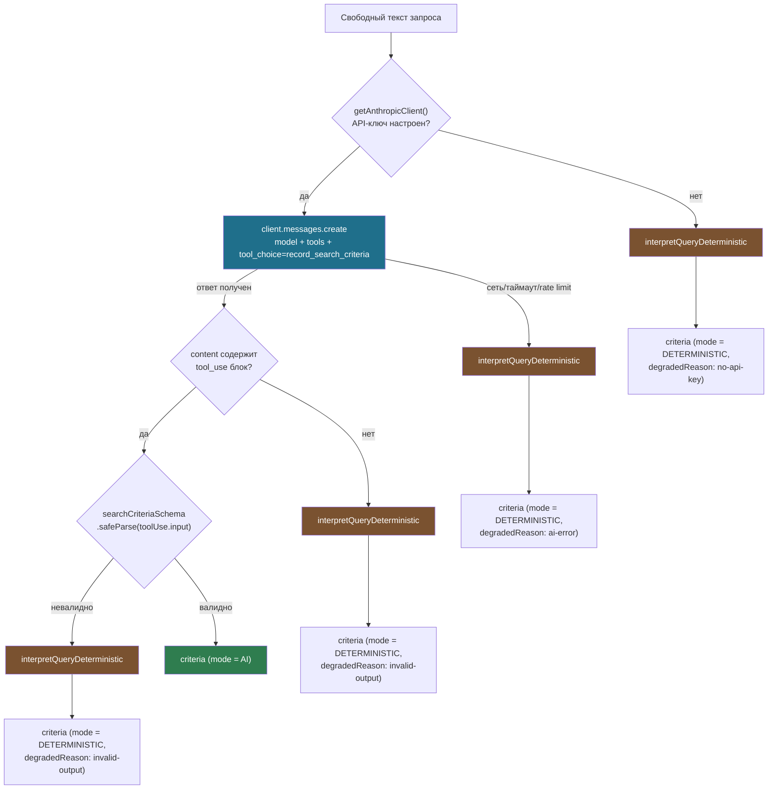
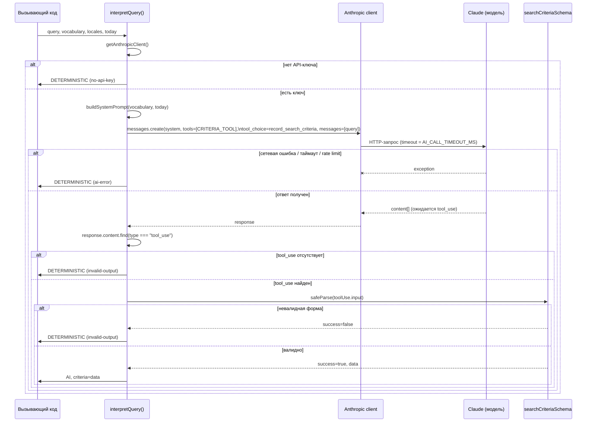
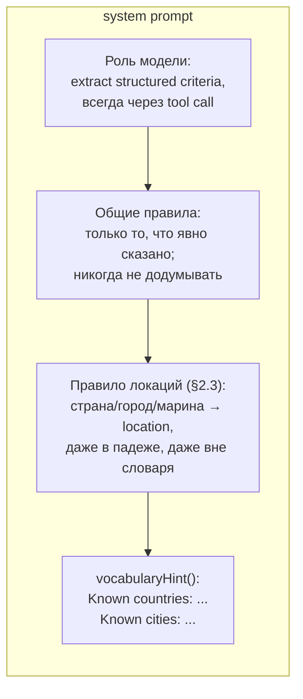
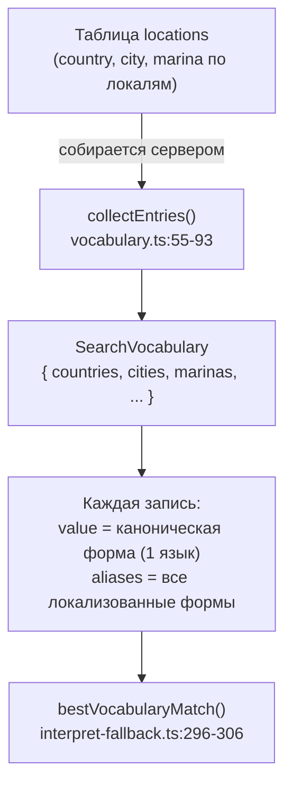
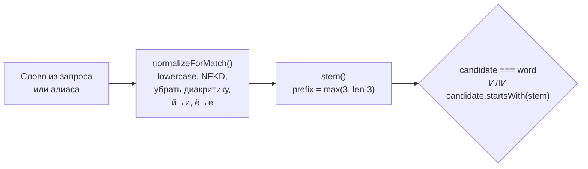
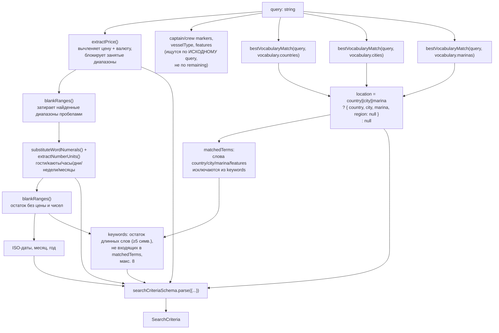
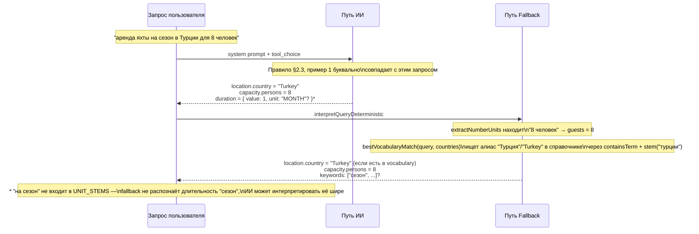

# Интерпретация поискового запроса: обработка Страны и Города

Документация процесса `SearchQueryInterpreter` (spec §4) с фокусом на то, как
поля `location.country` и `location.city` извлекаются из свободного текста
запроса — двумя независимыми путями: ИИ (Claude, tool use) и детерминированным
fallback-парсером.

Файлы, о которых идёт речь:

- `src/server/ai/query-interpreter.ts` — вызов Claude, системный промпт, tool-schema.
- `src/lib/search/interpret-fallback.ts` — детерминированный парсер (без сети, без ИИ).
- `src/lib/search/vocabulary.ts` — справочник стран/городов/марин, построенный из таблицы `locations`.
- `src/lib/search/text.ts` — нормализация текста, стемминг, сопоставление терминов.
- `src/lib/search/criteria.ts` — итоговая схема `SearchCriteria` (zod) и её инварианты.

---

## 1. Общая картина: два пути к одному результату



Ключевое архитектурное решение (см. docstring `query-interpreter.ts:6-19`):
**результаты двух путей никогда не смешиваются**. Либо весь результат от ИИ,
либо весь результат от детерминированного парсера — иначе пользователю,
глядящему на чипы критериев, придётся объяснять, откуда взялось противоречивое
поле.

---

## 2. Путь ИИ: `interpretQuery()`

### 2.1 Последовательность вызова



### 2.2 Системный промпт: как строится

`buildSystemPrompt(vocabulary, today)` (`query-interpreter.ts:119-147`) собирает
единый текстовый блок, отправляемый в поле `system`. Он состоит из четырёх
частей:



### 2.3 Правило про Страну/Город — сердце промпта

Дословный фрагмент (`query-interpreter.ts:128-137`):

```
- Any place name the request states (country, region, city or marina) MUST go into `location`,
  in English — never leave it in `keywords` or drop it. This applies even when the place is not
  one of the known values listed below: the known list is only a spelling reference for places
  we already have, not an allow-list of what counts as a location. A place name stays a place
  name no matter what else is in the sentence or what grammatical case it's in:
  - 'аренда яхты на сезон в Турции для 8 человек' still has a country — 'Турции' is 'Turkey'
    inflected, not a word to skip — so location.country must be 'Turkey' there, not null.
  - 'яхта в Дубае' still has a city — 'Дубае' is 'Dubai' inflected — so location.city must be
    'Dubai', not left out or put in keywords, even though the request is short and has nothing
    else to extract.
```

Это правило решает две конкретные проблемы русскоязычного ввода:

| Проблема | Без правила | С правилом |
|---|---|---|
| Падежи ("в Турции", "в Дубае") | Модель может не узнать словоформу и оставить `location: null` | Явные примеры учат модель распознавать инфлексию как то же место |
| Справочник — не ограничитель | Модель может решить, что раз страны нет в `Known countries`, её нельзя вернуть | Явно сказано: справочник — подсказка написания, а не allow-list |

### 2.4 `vocabularyHint()` — подсказка написания

`query-interpreter.ts:103-117`. Строит две строки из `SearchVocabulary`:

```
Known countries: Greece, Croatia, Turkey, ...   (до 60 значений)
Known cities: Athens, Split, Dubai, ...          (до 80 значений)
```

Значения берутся из `vocabulary.countries[].value` / `vocabulary.cities[].value`
— то есть из **канонической формы** записи в справочнике (`vocabulary.ts:14-26`),
которая всегда на одном языке (обычно английском — первый непустой label по
`preferredLocaleOrder`), чтобы модель отвечала значением, которое внутренний
provider сможет сопоставить с `locations` напрямую по значению, а не по
локализованному лейблу.

**Важно**: лимит `slice(0, 60)` / `slice(0, 80)` — это ограничение размера
промпта, а не ограничение того, что модель имеет право вернуть. Правило §2.3
явно разрешает возвращать место, которого нет в этом списке.

### 2.5 Схема ответа: `CRITERIA_TOOL.input_schema.location`

`query-interpreter.ts:39-47`:

```ts
location: {
  type: ["object", "null"],
  properties: {
    country: { type: ["string", "null"], description: "Country name in English." },
    region:  { type: ["string", "null"] },
    city:    { type: ["string", "null"], description: "City name in English." },
    marina:  { type: ["string", "null"] },
  },
},
```

Модель обязана вызвать инструмент `record_search_criteria`
(`tool_choice: { type: "tool", name: "record_search_criteria" }`) — свободный
текстовый ответ невозможен в принципе, что убирает целый класс ошибок парсинга
("please reply with JSON").

### 2.6 Повторная валидация — ответу модели не доверяют

Даже успешный `tool_use` не считается готовым результатом:

```ts
const parsed = searchCriteriaSchema.safeParse(toolUse.input);
if (!parsed.success) {
  return { criteria: deterministic(), mode: "DETERMINISTIC", degradedReason: "invalid-output" };
}
```

`searchCriteriaSchema` (`criteria.ts:76-111`) — та же схема, что использует
детерминированный путь. Для `location.country`/`location.city` это `orNull(freeText(100))`
— то есть непустая строка ≤100 символов или `null`; всё остальное (не-строка,
пустая строка, слишком длинная) откатывается на `null` через `.catch(null)`,
а не валит весь парсинг.

---

## 3. Путь Fallback: `interpretQueryDeterministic()`

Работает без сети и без ИИ — чистые функции, покрытые unit-тестами
(`interpret-fallback.test.ts`). Используется в четырёх случаях: нет API-ключа,
сетевая ошибка/таймаут, отсутствует `tool_use`, ответ не прошёл валидацию.

### 3.1 Откуда берётся справочник для сопоставления



`collectEntries()` (`vocabulary.ts:55-93`) схлопывает `{locale: label}` карты
в записи `VocabularyEntry`, объединяя дубликаты по каноническому значению.
Канонический `value` — первый непустой label из `preferredLocaleOrder`;
все локализованные варианты (включая нестандартные локали) попадают в
`aliases`, поэтому добавление страны в БД **сразу** обучает оба пути поиска
(ИИ — через `vocabularyHint`, fallback — через `bestVocabularyMatch`) без
единой строчки кода (CLAUDE.md §9).

### 3.2 `bestVocabularyMatch()` — выбор лучшего совпадения

`interpret-fallback.ts:296-306`:

```ts
function bestVocabularyMatch(text: string, entries: VocabularyEntry[]): string | null {
  let best: { value: string; length: number } | null = null;
  for (const entry of entries) {
    for (const alias of entry.aliases) {
      if (!containsTerm(text, alias)) continue;
      const length = normalizeForMatch(alias).length;
      if (!best || length > best.length) best = { value: entry.value, length };
    }
  }
  return best?.value ?? null;
}
```

Перебирает **все** алиасы **всех** записей и берёт совпадение с самым длинным
алиасом. Из-за этого "Split Marina" побеждает более короткое "Split", если оба
встречаются в тексте — важно для правильного различения марины и города с тем
же именем.

### 3.3 `containsTerm()` + `stem()` — сопоставление с учётом падежей

`text.ts:11-51`. Три слоя нормализации:



Пример для города "Дубай" → запрос "яхта в Дубае":

1. `normalizeForMatch("Дубае")` → `"дубае"`.
2. Алиас в справочнике: `"дубай"`. `stem("дубай")` = `"дуба"` (5 символов - 3 = 2, но floor 3 → берём 3 символа... на практике `max(3, 5-3)=3` → `"дуб"`... итоговая длина зависит от слова).
3. `"дубае".startsWith(stem("дубай"))` → true → совпадение.

Многословные термины ("Cape Town", "Марина Каштела") требуют **непрерывной
последовательности** слов (`text.ts:41-48`), что исключает ложные совпадения
из слов, разбросанных по разным частям предложения.

### 3.4 Место сборки `location` в общем пайплайне парсера



Важные детали:

- Страна/город/марина ищутся **по исходному `query`**, а не по `remaining`
  (тексту, из которого уже вычищены цена и числа) — в отличие от дат и
  ключевых слов. Это осознанный выбор: диапазоны, затёртые `blankRanges` для
  цены/чисел, не пересекаются с местами, так что доп. защита не нужна, а
  прогон по полному тексту сохраняет контекст многословных алиасов.
- Поле `region` детерминированный парсер **никогда** не заполняет — оно
  существует в схеме только для ИИ-пути. Fallback всегда пишет `region: null`.
- Найденные `country`/`city`/`marina` попадают в `matchedTerms`
  (`interpret-fallback.ts:378-382`) и вычитаются из `keywords`, чтобы не
  задваивать сигнал (например, "Турция" не должна ещё раз всплыть как
  ключевое слово).

### 3.5 Условие создания объекта `location`

```ts
location: country || city || marina ? { country, city, marina, region: null } : null,
```

Если **хотя бы одно** из трёх полей найдено — создаётся объект; иначе `location`
целиком `null`. Это соответствует общему принципу "absent means null, never a
guess" (`criteria.ts:8-13`) — частичное совпадение лучше, чем ничего, но
никогда не выдумывается лишнее поле.

---

## 4. Сравнение путей: ИИ vs Fallback

| Критерий | ИИ (`interpretQuery`) | Fallback (`interpretQueryDeterministic`) |
|---|---|---|
| Источник знания о местах | Обучение модели + `vocabularyHint()` как подсказка написания | Только `SearchVocabulary` (данные из `locations`) |
| Место **вне** справочника | Распознаётся (правило §2.3 явно это требует) | **Не** распознаётся — алиасов для несуществующей записи просто нет |
| Падежи/инфлексия | Обрабатываются через понимание языка моделью + few-shot примеры в промпте | Обрабатываются алгоритмически через `stem()` (совпадение по префиксу) |
| `location.region` | Может быть заполнено | Всегда `null` |
| Сеть / стоимость | HTTP-запрos к Claude, таймаут `AI_CALL_TIMEOUT_MS` | Нет сети, чистые синхронные функции |
| Тестируемость | Через моки клиента | Юнит-тесты без моков (`interpret-fallback.test.ts`) — spec §2 "AI понимает, код контролирует процесс" |
| Что произойдёт при некорректном выводе | Откат на fallback с `degradedReason` | N/A — это и есть конечная точка отказа |

---

## 5. Диагностика: `degradedReason`

Каждый результат несёт информацию о том, почему сработал fallback (если
сработал) — записывается в `search_runs` для последующего анализа, но
**никогда не показывается пользователю в сыром виде** (`query-interpreter.ts:27`):

| `degradedReason` | Когда возникает |
|---|---|
| `no-api-key` | `getAnthropicClient()` вернул `null` — ключ не сконфигурирован |
| `ai-error` | Исключение при вызове `messages.create` — сеть, таймаут, rate limit, биллинг |
| `invalid-output` | Ответ получен, но либо нет блока `tool_use`, либо `searchCriteriaSchema.safeParse` не прошёл |
| *(отсутствует)* | `mode: "AI"` — успешная интерпретация моделью |

---

## 6. Пример трассировки: "аренда яхты на сезон в Турции для 8 человек"



Разница между путями здесь: если "Турция" **есть** в справочнике `locations`,
оба пути совпадут. Если её там ещё нет (например, страна пока не добавлена в
БД) — ИИ всё равно вернёт `"Turkey"` благодаря правилу §2.3, а fallback вернёт
`location: null` для страны, потому что у него просто нет алиаса для
сопоставления.

---

## 7. Ссылки на код

| Тема | Файл | Строки |
|---|---|---|
| Оркестрация ИИ/fallback | `src/server/ai/query-interpreter.ts` | 157-201 |
| Системный промпт | `src/server/ai/query-interpreter.ts` | 119-147 |
| Правило про место в промпте | `src/server/ai/query-interpreter.ts` | 128-137 |
| `vocabularyHint()` | `src/server/ai/query-interpreter.ts` | 103-117 |
| Tool schema `location` | `src/server/ai/query-interpreter.ts` | 39-47 |
| Fallback: сборка location | `src/lib/search/interpret-fallback.ts` | 372-388 |
| `bestVocabularyMatch()` | `src/lib/search/interpret-fallback.ts` | 296-306 |
| `containsTerm()` / `stem()` / `normalizeForMatch()` | `src/lib/search/text.ts` | 11-51 |
| Построение справочника | `src/lib/search/vocabulary.ts` | 55-93 |
| Итоговая схема `SearchCriteria.location` | `src/lib/search/criteria.ts` | 76-84 |
