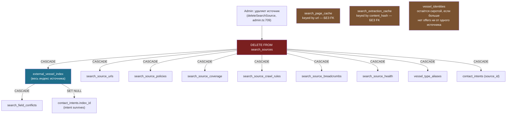

# Каскадное удаление источника поиска (`search_sources`)

Что реально происходит с проиндексированными данными, когда админ удаляет источник
(«коннектор») на `/admin/search-sources` — весь эффект целиком описан на уровне схемы БД
(`ON DELETE CASCADE`/`SET NULL`), в прикладном коде нет ни строчки логики очистки.
Проверено вживую через `information_schema.referential_constraints` на локальной БД
31.08.2026 (два источника: brilions.com, sailica.com).

Файлы, о которых идёт речь:

- `src/server/actions/admin.ts` (`deleteSearchSource`) — весь код действия: `requireAdmin` →
  `DELETE FROM search_sources WHERE id = ...` → `logAudit` → `revalidatePath`. Больше ничего.
- `src/app/[locale]/admin/search-sources/search-source-delete-button.tsx` — единственная
  защита перед удалением: `window.confirm(t("confirmDelete"))`.
- `messages/ru.json`/`en.json`, ключ `admin.searchSources.confirmDelete` — текст этого
  подтверждения.
- `supabase/migrations/` — FK-констрейнты объявлены в разных миграциях по мере появления
  каждой таблицы (`20260821140001_global_search.sql` и далее), поэтому источник истины ниже —
  не конкретный файл, а фактическое состояние `information_schema` в БД.

---

## 1. Что удаляется автоматически

Прямые внешние ключи на `search_sources.id`, все — `ON DELETE CASCADE`:

| Таблица | Что теряется |
|---|---|
| `external_vessel_index` | Весь проиндексированный каталог источника — то, ради чего вообще существует индексация |
| `search_source_urls` | Реестр URL (обнаруженные + вручную добавленные ссылки) |
| `search_source_policies` | Настройки rate-limit/cache/attribution/retention |
| `search_source_coverage` | Гео-покрытие источника |
| `search_source_crawl_rules` | Правила классификации URL по префиксу/regex |
| `search_source_breadcrumbs` | Кэш breadcrumb-меток для резолва локации |
| `search_source_health` | Состояние circuit breaker |
| `vessel_type_aliases` | Алиасы типов судна, специфичные для источника |
| `contact_intents` (по `source_id`) | Намерения связаться, привязанные к источнику |

Дальше, каскадом уже от `external_vessel_index` (то есть удаление источника triggers
**второй уровень** каскада):

| Таблица | Правило | Эффект |
|---|---|---|
| `search_field_conflicts` (`listing_id`) | `CASCADE` | Удаляется вместе со строкой индекса, к которой относился конфликт |
| `contact_intents` (`index_id`) | `SET NULL` | Сам intent не удаляется — просто теряет ссылку на конкретное объявление |

## 2. Диаграмма

## 3. Что НЕ удаляется — и почему это осознанно (в основном)

- **`search_page_cache`** (сырой HTML, ключ — `url`) и **`search_extraction_cache`** (кэш
  AI-классификации, ключ — `content_hash`) — у обеих таблиц вообще нет колонки `source_id`,
  то есть нет и FK. Это content-addressed кэши: одна и та же страница/контент теоретически
  мог бы встретиться у другого источника (маловероятно на практике, но так спроектировано),
  и живут они по TTL-логике на чтении (`PAGE_CACHE_MS`/`SITEMAP_CACHE_MS`), а не по привязке
  к конкретному источнику. После удаления источника его строки в этих таблицах остаются —
  безвредные, но бесполезные сироты, которые никогда не подчищаются отдельным job'ом.
- **`vessel_identities`** — сама строка идентичности судна не удаляется. `SET NULL` на
  `external_vessel_index.vessel_identity_id` работает в обратную сторону (когда удаляют саму
  identity, а не источник) и здесь не помогает: если у identity был offer только с удалённого
  источника, эта identity просто перестаёт иметь офферы (не сравнить это через
  `external_vessel_index`, так как его строки уже удалены), но сама запись в
  `vessel_identities` остаётся в базе бессрочно.

## 4. Известные пробелы (не исправлено, зафиксировано для следующей итерации)

1. **Диалог подтверждения не отражает масштаб.** `confirmDelete` сейчас — «Удалить этот
   источник? Действие необратимо.» Ни слова о том, что это стирает весь проиндексированный
   каталог (для sailica.com на момент проверки — 1946 строк реестра URL и соответствующий
   объём `external_vessel_index`). Стоит явно показывать счётчик перед подтверждением.
2. **Осиротевшие `vessel_identities`** не имеют механизма обнаружения/очистки — нет job'а,
   аналогичного `registry/index-retention.ts`'s `cleanupStaleListings`/`cleanupGoneListings`,
   который бы удалял identity-строки, оставшиеся без единого `external_vessel_index.vessel_identity_id`,
   на них указывающего.
3. **`search_page_cache`/`search_extraction_cache`** не имеют вообще никакой retention-политики
   (ни по возрасту, ни по «источник исчез») — растут бессрочно.
