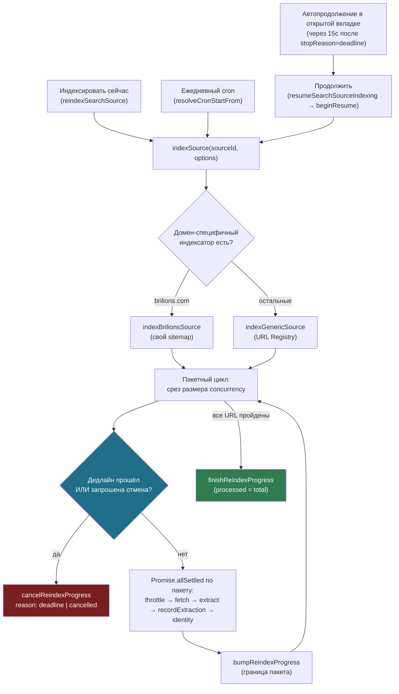

# Как происходит скан (реиндексация) источника

Полный путь фонового индексатора — от клика «Индексировать сейчас»/ежедневного cron'а до
записи строк в `external_vessel_index`, включая параллелизм, троттлинг, самоостановку по
таймауту, Resume/Stop и автопродолжение в открытой вкладке админки. Всё, что описано здесь,
уже реализовано и проверено вживую (см. этот же чат — источник sailica.com, 1946 URL).

Файлы, о которых идёт речь:

- `src/server/actions/admin.ts` — `reindexSearchSource` (свежий запуск), `resumeSearchSourceIndexing`
  (Продолжить), `stopSearchSourceIndexing` (Остановить), `updateIndexingSettings` (параллелизм +
  макс. время прогона).
- `src/server/search/index/indexer.ts` — `indexSource` (точка входа), `indexGenericSource`
  (selectors → JSON-LD → AI, через URL Registry).
- `src/server/search/index/brilions-indexer.ts` — `indexBrilionsSource` (свой sitemap-путь).
- `src/server/search/index/reindex-progress.ts` — вся запись/чтение состояния прогона
  (`startReindexProgress`, `bumpReindexProgress`, `finishReindexProgress`, `isCancelRequested`,
  `cancelReindexProgress`, `beginResume`, `resolveCronStartFrom`, `recordCronError`/`clearCronError`).
- `src/server/search/resilience/rate-limiter.ts` — `throttle` (пейсинг запросов к источнику,
  concurrency-safe очередь резервации).
- `src/server/queries/admin.ts` — `getReindexConcurrency`, `getReindexMaxDurationSeconds`,
  `getSearchSourceReindexProgress`.
- `src/app/api/cron/index-sources/route.ts` — ежедневный cron, резюм-aware.
- `src/lib/search/use-reindex-status.ts`, `reindex-button.tsx`, `reindex-progress-indicator.tsx` —
  клиентский поллинг, кнопки, автопродолжение в открытой вкладке.
- `supabase/migrations/2026083*_reindex_*.sql` — `search_sources.reindex_started_at/finished_at/
  total/processed/cancel_requested/last_stop_reason/last_cron_error(_at)`,
  `platform_settings.reindex_concurrency/reindex_max_duration_seconds`.

---

## 1. Точки запуска

Три равноправных способа начать/продолжить скан одного источника — все ведут в один и тот же
`indexSource`:

1. **«Индексировать сейчас»** (`/admin/search-sources/[id]/urls`) — `reindexSearchSource`, всегда
   с нуля (`startFrom = 0`).
2. **Ежедневный cron** (`vercel.json`, `0 2 * * *`) — для каждого включённого источника сам решает
   свежий проход / резюме / пропуск тика (`resolveCronStartFrom`).
3. **«Продолжить»** — вручную кликом, либо **автоматически** через 15 сек в открытой вкладке, если
   прошлый прогон остановился именно по таймауту (не по ручному Stop).

## 2. Диаграмма: от клика до записи в индекс



## 3. Что происходит внутри одного пакета

`concurrency` (админ-настройка, по умолчанию 3) кандидатов обрабатываются параллельно —
`throttle` при этом всё равно разносит сами сетевые запросы по `rps` источника (очередь
резервации в `rate-limiter.ts`), только последующая обработка (AI-классификация, запись в БД)
перекрывается по времени.

```mermaid
sequenceDiagram
    participant Loop as Пакетный цикл
    participant Throttle as throttle(sourceId)
    participant Fetch as fetchWithCache
    participant Extract as selectors → JSON-LD → AI
    participant DB as recordExtraction / external_vessel_index
    participant Identity as resolveVesselIdentity

    Loop->>Throttle: дождаться своего слота (1/rps)
    Throttle-->>Loop: слот получен
    Loop->>Fetch: GET страницы (кэш 24ч)
    alt страница не изменилась
        Fetch-->>Loop: contentUnchanged → touchExtraction, дальше
    else новый контент
        Fetch-->>Extract: HTML
        Extract-->>DB: normalized fields + fieldSource + confidence
        DB->>Identity: resolveVesselIdentity (best-effort, может дёрнуть AI-арбитраж)
    end
    Loop->>Loop: следующий кандидат в этом же пакете (параллельно)
```

## 4. Остановка и продолжение

- **Дедлайн** (`platform_settings.reindex_max_duration_seconds`, 30–280 сек, с запасом ниже
  жёсткого потолка Vercel в 300с) и **ручной Stop** проверяются только *между* пакетами, никогда
  посреди — пакет либо весь завершается, либо вообще не начинается. Поэтому `reindex_processed`
  после остановки всегда означает «все страницы до этой позиции гарантированно обработаны», и
  резюме продолжает ровно с этой границы, не пропуская и не задваивая страницы.
- Причина остановки пишется в `last_stop_reason` (`deadline` | `cancelled`) — только `deadline`
  триггерит автопродолжение в открытой вкладке; ручной Stop никогда не продолжается сам.
- Cron не знает о вкладках — он резюмирует **сам** на следующий ежедневный тик
  (`resolveCronStartFrom`: не индексировался или уже 100% → свежий проход; недобрано → резюме;
  выглядит как ещё бегущий → пропустить тик).
- Настоящий reject внутри `indexSource` (не дедлайн, не Stop — редкий случай необработанной
  ошибки БД) пишется в `search_sources.last_cron_error` и показывается бейджем «Крон» в списке
  источников; сбрасывается следующим успешным прогоном.
