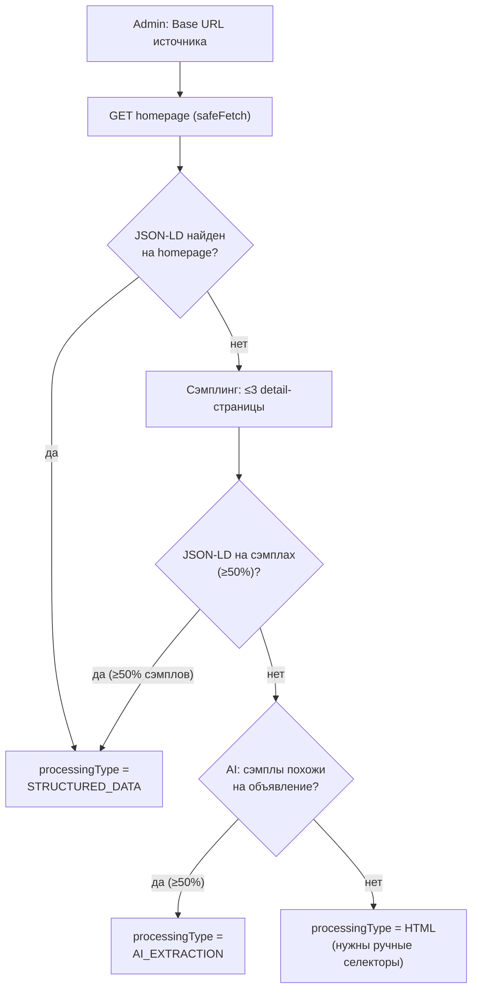
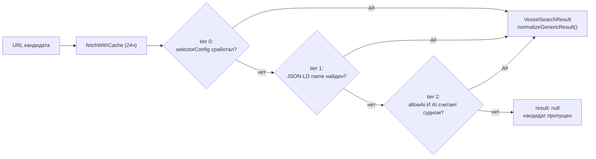

# JSON-LD в конвейере поиска судов

Разбор всех мест, где проект читает `schema.org`-разметку
(`application/ld+json`), и как она встроена в два разных процесса:
регистрацию источника администратором и рантайм-поиск по внешним сайтам.

## Коротко

- **Только на вход.** JSON-LD в проекте читается исключительно со сторонних
  сайтов-источников (провайдеры поиска). На собственных страницах судна
  (`vessels/[slug]`) платформа JSON-LD не публикует — для внешних поисковиков
  и AI-краулеров это открытый пробел.
- **Средний, бесплатный уровень.** В конвейере извлечения
  (`providers/generic/provider.ts`) JSON-LD стоит между ручными
  CSS-селекторами и AI-классификацией: дешевле и надёжнее модели, но требует,
  чтобы сайт-источник вообще публиковал разметку.
- **Двойная роль.** Один и тот же модуль (`lib/search/structured-data.ts`)
  используется и во время регистрации источника — чтобы предложить админу
  стратегию обработки (`STRUCTURED_DATA`), и во время боевого поиска — чтобы
  реально вытащить название/фото объявления.
- **Узкое поле полей.** Из JSON-LD берутся только `name`, `description`,
  `image`. Гости, каюты, тип судна, страна и город из structured data не
  читаются — эти поля остаются `null`, даже если результат пришёл с этого
  уровня.

## 1. Где именно это в коде

Восемь файлов касаются JSON-LD; ядро — два чистых парсера в одном модуле,
остальное — их потребители и тесты.

| Файл | Роль |
|---|---|
| `lib/search/structured-data.ts` | **Ядро.** Две функции без побочных эффектов: `extractJsonLdTypes(html)` собирает все `@type` со страницы (включая вложенные `@graph`); `extractJsonLdFields(html)` находит первый именованный узел, исключая site-wide типы (Organization, WebSite, BreadcrumbList и т.п.), и возвращает name/description/image. |
| `server/search/source-validation.ts` | Превью-проверка при регистрации источника в `/admin/search-sources`. Гоняет `extractJsonLdTypes` по домашней странице и по 2–3 сэмплам из sitemap, затем предлагает `processingType`. |
| `app/[locale]/admin/search-sources/search-source-form.tsx` | Рендерит отчёт валидации: найденные типы, статус по каждому сэмплу, предложенную стратегию — админ видит это перед сохранением источника. |
| `server/search/providers/generic/provider.ts` | `fetchAndNormalize()` — боевой путь. Вызывает `extractJsonLdFields` как второй уровень приоритета: после ручных селекторов, перед AI-классификацией. |
| `server/search/provider-registry.ts` | `isGenericEligible()` — источники со стратегией `STRUCTURED_DATA` (как и `AI_EXTRACTION`) автоматически получают generic-провайдера без единой строки кода под конкретный сайт. |
| `lib/validation/admin.ts` | Zod-схема, где `STRUCTURED_DATA` — одно из значений enum'а `SearchProcessingType` (наряду с `API / HTML / HYBRID / AI_EXTRACTION`). |
| `lib/search/structured-data.test.ts` | Юнит-тесты обеих функций ядра: malformed-скрипты, множественные `@type`, фильтрация site-wide узлов. |
| `docs/search-source-processing-strategies.md` | Документирует приоритет извлечения (спецификация §11): API → JSON-LD → HTML-селекторы → AI — как обоснование порядка веток в `fetchAndNormalize`. |

## 2. Регистрация источника: JSON-LD как сигнал для выбора стратегии

Когда админ добавляет новый сайт в `/admin/search-sources`,
`validateSearchSource()` ещё до сохранения проверяет, публикует ли сайт
structured data — и если да, почти всегда сразу предлагает
`processingType: STRUCTURED_DATA`, минуя более дорогие проверки.

`suggestProcessingType()` в `source-validation.ts`: гомпейдж-разметка решает
всё сразу; без неё — голосование по 2–3 сэмплам из sitemap; и только если ни
разметки, ни явного сходства с объявлением нет — источник помечается как
требующий ручных селекторов.

## 3. Боевой поиск: JSON-LD как средний, бесплатный уровень

На каждый запрос поиска `fetchAndNormalize()` проходит кандидатскую страницу
через три уровня подряд, возвращая результат с первого, который сработал —
приоритет ровно в порядке из спецификации §11.

| Уровень | Что делает | Стоимость |
|---|---|---|
| **tier 0 — ручные селекторы** | CSS-селекторы, заданные админом (`selectorConfig`). Самый точный уровень — админ буквально указал, где на странице лежат поля. | детерминировано · $0 |
| **tier 1 — JSON-LD** | `extractJsonLdFields`. Работает без всякой конфигурации сайта — но только name / description / image; остальные поля остаются `null`. | детерминировано · $0 |
| **tier 2 — AI-классификация** | `classifyCandidatePage` — вызов Anthropic (до 8с), только если стратегия источника не `HTML`. Единственный уровень, извлекающий guests/cabins/type/город. | Anthropic call · до 8с |

Первый сработавший уровень отдаёт результат и обрывает каскад — JSON-LD
проверяется только если ручной селектор не задан или не совпал, и только его
отсутствие открывает дорогу к AI-вызову.

## 4. Что проект не делает

Оба сценария выше — это чтение JSON-LD с чужих сайтов. Собственные страницы
платформы (`app/[locale]/(booking)/vessels/[slug]`) не публикуют
`<script type="application/ld+json">` ни с `Product`/`Offer` для судна, ни с
`TouristTrip` для экспедиций. По коду в `src/app` совпадений с `ld+json` нет
вообще.

**Асимметрия:** платформа умеет читать structured data конкурентов, чтобы
находить их объявления, но не отдаёт собственную — значит, поисковики и
AI-краулеры не получают от карточек судна и инициатив ничего, кроме
HTML/OpenGraph. Это не баг конвейера поиска, а отдельная, ещё не сделанная
задача на стороне выдачи.
