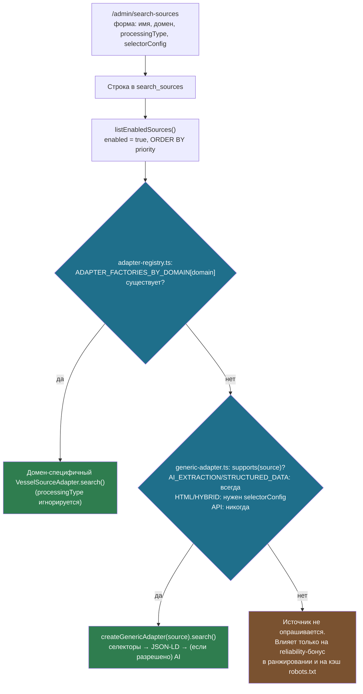
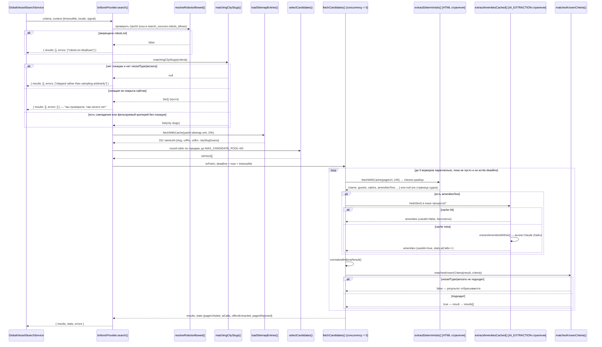

# Стратегии обработки внешних источников поиска (`processingType`)

Документация поля `processing_type` таблицы `search_sources` (spec §8, `Source
Registry`) — что означает каждое из пяти значений enum, что из этого реально
реализовано, и как это устроено на примере единственного подключённого сейчас
источника, brilions.com.

Файлы, о которых идёт речь:

- `supabase/migrations/20260821140001_global_search.sql`, `20260824090001_search_source_selector_config.sql` — DDL enum'а `search_processing_type`, таблицы `search_sources` и колонки `selector_config`.
- `src/server/search/source-registry.ts` — чтение реестра источников (`listEnabledSources`).
- `src/server/search/adapters/adapter-registry.ts` — связка «домен реестра ↔ адаптер» (`ADAPTER_FACTORIES_BY_DOMAIN`), плюс предфильтр по coverage.
- `src/server/search/adapters/adapter.ts` — интерфейс `VesselSourceAdapter`, который обязан реализовать любой адаптер, независимо от заявленной стратегии.
- `src/server/search/adapters/generic-adapter.ts`, `src/server/search/adapters/brilions-adapter.ts` — заворачивают провайдеры ниже в `VesselSourceAdapter`; `supports()` (эта eligibility-проверка) живёт в `generic-adapter.ts`.
- `src/server/search/providers/brilions/` — единственный домен-специфичный провайдер, `processingType = HYBRID`.
- `src/server/search/providers/generic/provider.ts` — провайдер без домен-специфичного кода: селекторы → JSON-LD → (если разрешено) AI, для любого источника, которого `generic-adapter.ts`'s `supports()` принимает.
- `src/server/search/providers/generic/extract-by-selectors.ts` — чистый экстрактор по `selectorConfig` (§1.1).
- `src/server/search/selector-suggestion.ts` — AI-подсказка `selectorConfig` по образцу страницы, вызывается из `source-validation.ts` при проверке источника.
- `src/lib/validation/admin.ts` — `selectorConfigSchema`/`parseSelectorConfig`.
- `src/app/[locale]/admin/search-sources/` — админка, где стратегия и `selectorConfig` задаются при добавлении источника.
- `src/server/search/README.md` — журнал живых проверок и найденных в проде багов; здесь не дублируется целиком, только релевантные места.

---

## 1. Что такое `processingType` и чем он **не** является

```sql
-- Extraction strategy for a source (spec §8). Each value corresponds to a code path, so adding a
-- strategy is a migration plus an implementation — unlike countries or currencies, which are
-- pure data (CLAUDE.md §9).
create type public.search_processing_type as enum (
  'API', 'HTML', 'STRUCTURED_DATA', 'AI_EXTRACTION', 'HYBRID'
);
```

Это единственное поле в проекте, которое комментарий миграции прямо
противопоставляет принципу CLAUDE.md §9 «страны/валюты/типы судов — это
данные, а не код»: **стратегия обработки — это код**. Значение поля не
запускает разный обработчик автоматически — сегодня оно **чисто описательное
и никем не диспетчеризуется во время выполнения**.

> **Обновление:** с добавлением `providers/generic/provider.ts` и
> `selectorConfig` это уже не совсем так — см. §1.1. Выбор провайдера
> всё ещё идёт в основном по домену, но для источника без домен-специфичного
> провайдера `processingType` (и, для `HTML`/`HYBRID`, `selectorConfig`)
> теперь тоже читается рантаймом и реально на него влияет.

> **Обновление (Э4):** домен-специфичный/generic провайдер (`{id, search}`) теперь только
> внутренняя деталь — `adapters/generic-adapter.ts`/`adapters/brilions-adapter.ts` заворачивают его
> в полный `VesselSourceAdapter` (Арх §10: `supports`/`search`/`getDetails`/`checkAvailability`/
> `getContactCapability`), и именно эта обёртка регистрируется в `ADAPTER_FACTORIES_BY_DOMAIN`.
> Убедиться в этом можно по `adapters/adapter-registry.ts` (упрощено — реальная версия ещё
> предфильтрует по `coverage.ts`'s `sourceCovers`, Э3):

```ts
const ADAPTER_FACTORIES_BY_DOMAIN: Record<string, (source: SearchSource) => VesselSourceAdapter> = {
  "brilions.com": createBrilionsAdapter,
};

// adapters/generic-adapter.ts's own supports() — the eligibility check this section describes.
function supports(source: SearchSource): boolean {
  switch (source.processingType) {
    case "AI_EXTRACTION":
    case "STRUCTURED_DATA":
      return true;
    case "HTML":
    case "HYBRID":
      return source.selectorConfig !== null;
    case "API":
      return false;
  }
}

export async function listExternalAdapters(): Promise<{ adapters: VesselSourceAdapter[] }> {
  const sources = await listEnabledSources();
  const adapters = sources
    .map((source) => (ADAPTER_FACTORIES_BY_DOMAIN[source.domain] ?? createGenericAdapter)(source))
    .filter((adapter) => adapter.supports(/* ... */));
  return { adapters };
}
```

Выбор провайдера идёт **по домену в первую очередь**: домен с
домен-специфичным провайдером (сейчас — только `brilions.com`) всегда
получает его, **независимо от того, что выбрано в поле `processingType`** —
поле в этом случае по-прежнему чисто декларативное. Но для любого домена
*без* домен-специфичного провайдера `processingType` больше не игнорируется:
`AI_EXTRACTION` и `STRUCTURED_DATA` запускают `createGenericAdapter(source)`
(§1.1) сразу, без единой строчки нового кода; `HTML` и `HYBRID` запускают его
тоже, но только когда админ заполнил `selectorConfig` в форме (вручную или
через AI-подсказку, §1.2) — без него они остаются незадействованными, как и
`API`, для которого генерализация сознательно не сделана (слишком разные
схемы авторизации/пагинации без единого реального примера). Ни один из пяти
вариантов не приводит к падению поиска — это проверяет
`adapter-registry.test.ts`.



### 1.1 Универсальный провайдер (`providers/generic/provider.ts`)

Для любого включённого источника без домен-специфичной реализации, которого
`generic-adapter.ts`'s `supports()` принимает, `createGenericAdapter(source)`
собирает `VesselSourceAdapter` на лету (внутри — тот же `createGenericProvider(source)`,
дополненный `supports`/`getDetails`/`checkAvailability`/`getContactCapability`):
обходит сайтмап источника (те же `crawl/`-утилиты §4), на каждой странице пробует
извлечение в три тира по порядку:

1. **Селекторы** (`extract-by-selectors.ts`), если у источника задан
   `selectorConfig` — самый дешёвый и точный вариант, админ явно указал, где
   искать поля. `name` не резолвился → тир считается неудачным, идём дальше.
2. **JSON-LD** (`extractJsonLdFields`) — бесплатно и детерминированно, когда
   источник его публикует.
3. **AI-классификация** (`classifyCandidatePage`, один вызов Claude на
   страницу с кэшем по хэшу контента) — **только если `allowAi`**.
   `allowAi = source.processingType !== "HTML"`: чистый `HTML` обязан
   оставаться бесплатным и детерминированным (это его смысл в таблице §2), и
   если ни селекторы, ни JSON-LD не дали результата — просто не даёт
   результата по этой странице, не тратя AI-вызов. `HYBRID` (и
   `AI_EXTRACTION`/`STRUCTURED_DATA`, которые сюда доходят всегда, поскольку
   `allowAi` истинно для них) идут в AI как раньше.

**Важно:** для `AI_EXTRACTION` и `STRUCTURED_DATA` без `selectorConfig`
провайдер по-прежнему ведёт себя **идентично** — тиры 2 и 3 не зависят от
того, какое из этих двух значений выбрано. Различие между ними в форме
админки остаётся подсказкой/декларацией человеку, а не переключателем кода
внутри `provider.ts` — в отличие от `HTML`/`API`, для которых `processingType`
уже определяет, **дойдёт ли** до этого кода вообще.

### 1.2 AI-подсказка селекторов (`selector-suggestion.ts`)

При клике «Проверить источник» в админке (`source-validation.ts`) для каждой
сэмплированной кандидатской страницы, у которой нет JSON-LD и
`classifyCandidatePage` уже распознал её как карточку судна (confidence
≥ 0.5), дополнительно вызывается `suggestSelectors(html)` — один запрос к
Claude Haiku с очищенным от `script/style/svg` HTML той же уже загруженной
страницы (без лишнего похода на сайт), который предлагает CSS-селекторы для
полей `GenericExtractedFields`. Результат — `suggestedSelectorConfig` в
отчёте проверки, кнопка «Применить» в форме подставляет его в JSON-textarea
`selectorConfig`, как уже сделано для `suggestedProcessingType`. Это только
подсказка: ничего не сохраняется и не применяется без явного клика админа, и
никогда не бросает исключение — при отсутствии ключа/таймауте/невалидном
ответе просто нет подсказки.

---

## 2. Пять стратегий: что каждая означает и что готово

| Стратегия | Что означает для реализации провайдера | Плюсы / минусы | Статус | Диспетчеризуется ли рантаймом |
|---|---|---|---|---|
| `API` | Источник отдаёт JSON/XML через собственный API — провайдер делает типизированный HTTP-запрос, без парсинга разметки | Быстро, устойчиво к редизайну сайта; требует у источника открытого API и часто ключа доступа | Не реализовано ни для одного источника; сознательно не обобщается (см. §1) | Нет — нужен домен-специфичный провайдер в `ADAPTER_FACTORIES_BY_DOMAIN` |
| `HTML` | Провайдер парсит HTML по CSS/DOM-селекторам (в проекте — `cheerio`) | Работает на любом сайте без API; ломается при смене вёрстки источника — требует сопровождения селекторов | Реализовано и для brilions (домен-специфичные селекторы, `extract.ts`), и для любого нового источника через `selectorConfig` + `extract-by-selectors.ts` (§1.1) | **Да, если задан `selectorConfig`** — иначе нет (только через `ADAPTER_FACTORIES_BY_DOMAIN`) |
| `STRUCTURED_DATA` | Провайдер читает встроенную микроразметку страницы (JSON-LD, `schema.org`, Open Graph) вместо сырого DOM | Надёжнее HTML-парсинга (структура задаётся самим источником), но работает только если источник её публикует | Реализовано для любого нового источника — `providers/generic/provider.ts` (§1.1) | **Да, всегда** — `generic-adapter.ts`'s `supports()` |
| `AI_EXTRACTION` | Текст страницы целиком передаётся модели (Claude) с просьбой извлечь данные | Переживает изменение вёрстки, справляется с произвольным свободным текстом; дороже и медленнее HTML/API на страницу, менее детерминирован | Реализовано и для brilions (`ai-extract.ts`, только для текста об экипаже/удобствах), и для любого нового источника через generic-провайдер (§1.1) | **Да, всегда** — тот же `generic-adapter.ts`'s `supports()`; на generic-провайдере ведёт себя идентично `STRUCTURED_DATA`, если `selectorConfig` не задан (см. §1.1) |
| `HYBRID` | Комбинация: детерминированный разбор (`selectorConfig`) для полей на строго определённом месте разметки + `AI_EXTRACTION` для свободного текста, который не разложить по селекторам | Берёт скорость/надёжность детерминированного пути там, где это возможно, и гибкость ИИ там, где данные неструктурированы | Домен-специфичный пример — `brilionsProvider`; для любого нового источника — через `selectorConfig` (селекторы) + AI-фолбэк generic-провайдера (§1.1) | **Да, если задан `selectorConfig`** — так же, как `HTML`, но с разрешённым AI-фолбэком (`allowAi=true`) |

Важное следствие: если сегодня выбрать в форме `API` для нового источника,
это будет **корректно с точки зрения БД и валидации**
(`searchProcessingTypeValues` в `src/lib/validation/admin.ts` принимает все
пять), но результат будет тем же, что и без строки вовсе, пока кто-то не
напишет `VesselSourceAdapter` под этот домен и не пропишет его в
`ADAPTER_FACTORIES_BY_DOMAIN`. `HTML`/`HYBRID` без `selectorConfig` ведут себя так
же — но стоит заполнить конфиг (вручную или через AI-подсказку §1.2), и они
сразу начинают сканироваться через generic-провайдер. `STRUCTURED_DATA` и
`AI_EXTRACTION` работают через generic-провайдер вообще без дополнительной
настройки. `adapter-registry.test.ts` фиксирует это поведение для всех
комбинаций.

---

## 3. Единственный работающий пример: `brilionsProvider` (`HYBRID`)

### 3.1 Зачем именно HYBRID для этого источника

Из докстринга `provider.ts:26-61`: сайт публикует ~312 судов по фиксированным
ACF-полям (`.acf-field` → название/гости/каюты/длина/год, `<b>Порт:</b>` →
город) — это стабильная структура, которую надёжно и дёшево разобрать
детерминированно. Но список экипажа/удобств на странице — это свободный
текст прозой, без предсказуемых селекторов на каждой странице сайта. Отсюда
разделение: `HTML` для первого, `AI_EXTRACTION` для второго, объединённые в
одну стратегию `HYBRID`.

### 3.2 Полный поток одного поиска



### 3.3 Три уровня отказа: не баг, а осознанный дизайн «пустого, но честного» результата

Провайдер различает три разных «ничего не нашли», и каждое означает разное
(комментарий `provider.ts:40-49`):

1. **Локация есть, сайт её покрывает** → ограниченная по времени и числу
   выборка конкретно по городу.
2. **Локации нет, но есть `vesselType`/`persons`** → тот же бюджет, но
   round-robin по *всем* известным городам сайта, чтобы источник не выпадал
   из мультиисточникового поиска молча.
3. **Локации нет и фильтровать нечем, ИЛИ локация есть, но сайт её не
   покрывает** → 0 запросов к сайту, причина явно попадает в `errors`, а не
   тихий пустой массив и не случайная выборка «на всякий случай».

Это отдельная, независимая от `internal-provider.ts` логика: внутренний
поиск (по своей БД `locations`) и внешний (brilions) гейтятся каждый по
своему собственному представлению о покрытии — см.
[`docs/ai-search-interpretation.md`](./ai-search-interpretation.md) для того,
как это выглядит на примере страны, которой нет в `locations`.

### 3.4 Бюджет времени, а не бюджет страниц

`MAX_CANDIDATE_POOL = 60` — это верхняя граница *кандидатов в очереди*, а не
гарантия, что все 60 будут реально запрошены. Реальный лимит —
`context.timeoutMs`: `fetchCandidates()` держит пул из `FETCH_CONCURRENCY = 5`
воркеров, каждый тянет следующий индекс из общего курсора и останавливается
перед стартом следующей страницы, если `Date.now() > deadline`. Из докстринга
`fetchCandidates` (`provider.ts:158-164`): пул воркеров с общим курсором
выбран специально вместо чанкования по 5 — иначе одна медленная холодная
страница блокировала бы весь свой чанк, пока не ответит.

Два независимых кэша меняют, сколько страниц реально влезает в бюджет:

| Кэш | Где живёт | TTL | Что ускоряет |
|---|---|---|---|
| `search_page_cache` (БД) | Supabase, `page-cache.ts` / `cached-fetch.ts` | 24 часа | Повторный HTTP-запрос к сайту-источнику (для одной и той же страницы — 1 round-trip к Supabase вместо запроса к brilions.com) |
| `amenitiesCache` (in-memory) | `Map` внутри процесса, ключ — хэш текста удобств | Время жизни процесса, без вытеснения (корпус ~312 судов — маленький) | Повторный вызов Claude для байт-идентичного текста удобств — в т.ч. между разными поисками в одном тёплом процессе |

Отсюда практическое следствие, зафиксированное в `README.md`: повторный
поиск получает заметно больше страниц в тот же временной бюджет, чем полностью
холодный запрос.

---

## 4. Инфраструктура краулинга — общая для любой будущей стратегии

`src/server/search/crawl/` не привязана к brilions и не завязана на
`processingType` — это то, чем **обязан** пользоваться любой будущий
провайдер, какую бы стратегию (`API`, `STRUCTURED_DATA`, чистый
`AI_EXTRACTION`) он ни реализовывал, кроме случая `API` с доверенным партнёрским
эндпоинтом:

| Файл | Роль |
|---|---|
| `ip-range.ts` | Чистая проверка приватных/зарезервированных IPv4/IPv6-диапазонов |
| `safe-fetch.ts` | SSRF-защищённый fetch: резолв хоста на каждый редирект, лимит размера ответа, раздельные connect/read таймауты |
| `robots-rules.ts` | Чистый парсинг `User-agent: *`, longest-prefix-match |
| `robots.ts` | Живая проверка robots.txt через `safeFetch`, результат кэшируется в `search_sources.robots_allows` |
| `page-cache.ts` / `cached-fetch.ts` | БД-кэш страниц (`search_page_cache`) |

`robots_allows = null` в БД трактуется кодом как «ещё не проверено» и
обязывает перепроверить — не как «разрешено» (см. комментарий
`source-registry.ts:30`). Наравне с `enabled` это поле реестра реально
управляет поведением рантайма напрямую — и с добавлением generic-провайдера
(§1.1) `processingType` тоже вошёл в эту категорию для четырёх из пяти
значений (`AI_EXTRACTION`, `STRUCTURED_DATA` — всегда; `HTML`, `HYBRID` —
когда заполнен `selector_config`, который сам по себе тоже стал полем,
управляющим рантаймом напрямую); только `API` остаётся чисто декларативным,
пока нет домен-специфичного провайдера.

---

## 5. Что нужно, чтобы добавить источник с новой стратегией

Для `AI_EXTRACTION` и `STRUCTURED_DATA` шаги 2–3 ниже не нужны вовсе — строка
в реестре достаточна, generic-провайдер (§1.1) подхватывает такой источник
сам. Для `HTML` и `HYBRID` шаги 2–3 тоже не нужны, если заполнить
`selectorConfig` в форме (вручную или через AI-подсказку §1.2) — тогда их
тоже подхватывает generic-провайдер. Только для `API`, и для `HTML`/`HYBRID`
без `selectorConfig`, на новом домене нужен домен-специфичный провайдер —
шаги по коду и `wiringHint`:

1. Добавить строку в `search_sources` (через `/admin/search-sources` или SQL) —
   имя, домен, `baseUrl`, `sourceType`, желаемый `processingType` (это поле —
   декларация того, что вы собираетесь реализовать на шаге 2, ничего не
   активирует само по себе).
2. Реализовать `VesselSourceAdapter` (`adapters/adapter.ts`) для этого домена —
   единственное жёсткое требование интерфейса: `search()` никогда не бросает
   исключение, ошибки источника попадают в `errors`, а не роняют весь поиск.
   Использовать `crawl/`-инфраструктуру из §4 для сетевых запросов, если
   стратегия предполагает обход страниц.
3. Зарегистрировать провайдер в `ADAPTER_FACTORIES_BY_DOMAIN` (`adapters/adapter-registry.ts`)
   по тому же домену, что в строке реестра.
4. Если источник отдаёт фото — добавить домен в `images.remotePatterns`
   (`next.config.ts`); в README зафиксирован реальный баг, когда это забыли
   для brilions.com и `next/image` тихо ронял серверный рендер в клиентский
   фолбэк.

До шага 3 запись в реестре влияет только на ранжирование (через
`getSourceReliability()`) и на кэш `robots_allows` — поиск её не опрашивает.

---

## 6. Связанные документы

- [`docs/ai-search-interpretation.md`](./ai-search-interpretation.md) — как формируются критерии поиска (`SearchCriteria`), которые провайдер получает во входных данных `search()`.
- `src/server/search/README.md` — журнал реализации по разделам spec, включая три реальных бага/ограничения, найденных при живой проверке brilions.com (баг `next/image`, отсутствие жёсткой фильтрации по типу/вместимости, ограниченное покрытие AI-селектора удобств).
- `src/server/search/EXTERNAL_SEARCH_INDEXING_PLAN.md` — план замены live-краулинга внутри пользовательского запроса на фоновый индекс (следующий шаг, не начат).
