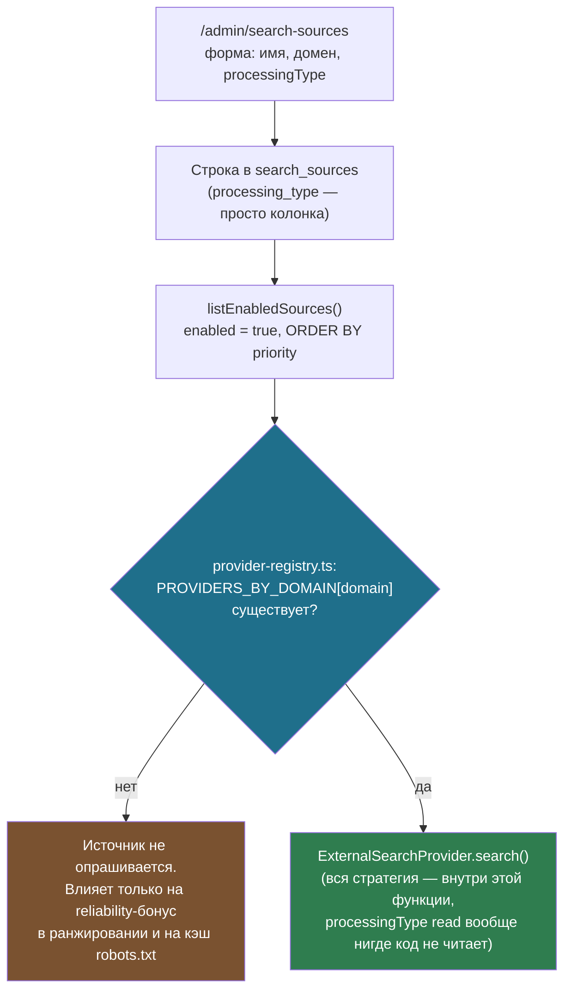
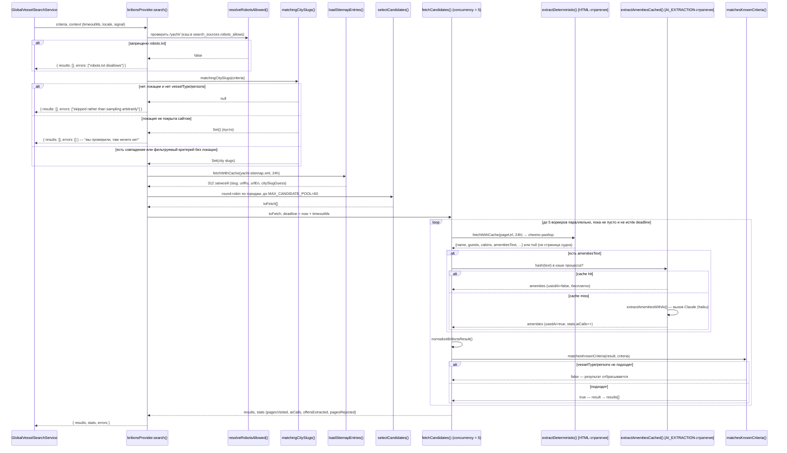

# Стратегии обработки внешних источников поиска (`processingType`)

Документация поля `processing_type` таблицы `search_sources` (spec §8, `Source
Registry`) — что означает каждое из пяти значений enum, что из этого реально
реализовано, и как это устроено на примере единственного подключённого сейчас
источника, brilions.com.

Файлы, о которых идёт речь:

- `supabase/migrations/20260821140001_global_search.sql` — DDL enum'а `search_processing_type` и таблицы `search_sources`.
- `src/server/search/source-registry.ts` — чтение реестра источников (`listEnabledSources`).
- `src/server/search/provider-registry.ts` — связка «домен реестра ↔ реализованный провайдер».
- `src/server/search/providers.ts` — интерфейс `ExternalSearchProvider`, который обязан реализовать любой провайдер, независимо от заявленной стратегии.
- `src/server/search/providers/brilions/` — единственная реализация, `processingType = HYBRID`.
- `src/app/[locale]/admin/search-sources/` — админка, где стратегия выбирается при добавлении источника.
- `src/server/search/README.md` — журнал живых проверок и найденных в проде багов; здесь не дублируется целиком, только релевантные места.

---

## 1. Что такое `processingType` и чем он **не** является

```sql
-- Extraction strategy for a source (spec §8). Each value corresponds to a code path, so adding a
-- strategy is a migration plus an implementation — unlike countries or currencies, which are
-- pure data (CLAUDE.md §9).
create type public.search_processing_type as enum (
  'API', 'HTML', 'STRUCTURED_DATA', 'AI_EXTRACTION', 'HYBRID'
);
```

Это единственное поле в проекте, которое комментарий миграции прямо
противопоставляет принципу CLAUDE.md §9 «страны/валюты/типы судов — это
данные, а не код»: **стратегия обработки — это код**. Значение поля не
запускает разный обработчик автоматически — сегодня оно **чисто описательное
и никем не диспетчеризуется во время выполнения**.

Убедиться в этом можно по `provider-registry.ts`:

```ts
const PROVIDERS_BY_DOMAIN: Record<string, ExternalSearchProvider> = {
  "brilions.com": brilionsProvider,
};
```

Выбор провайдера идёт **по домену**, а не по `processingType`. Значение поля
в форме админки — это то, что человек-разработчик объявляет о том, как
устроен провайдер, который ему предстоит написать и зарегистрировать здесь
вручную. Если добавить в реестр строку с `processingType: "API"` для сайта,
для которого ещё не существует кода в `providers/`, поиск не сломается и не
попытается угадать — `getActiveExternalProviders()` просто не найдёт этот
домен в карте и не вызовет его вообще (запись повлияет только на бонус в
ранжировании через `getSourceReliability()` и на кэш `robots_allows`). Именно
это объясняет `wiringHint` в самой админке:

> «Включение/выключение уже подключённого источника применяется сразу — без
> изменения кода. Но добавление совсем нового сайта здесь само по себе его не
> сканирует: для него нужно реализовать провайдера в коде и зарегистрировать
> в `provider-registry.ts`».



---

## 2. Пять стратегий: что каждая означает и что готово

| Стратегия | Что означает для реализации провайдера | Плюсы / минусы | Статус |
|---|---|---|---|
| `API` | Источник отдаёт JSON/XML через собственный API — провайдер делает типизированный HTTP-запрос, без парсинга разметки | Быстро, устойчиво к редизайну сайта; требует у источника открытого API и часто ключа доступа | Не реализовано ни для одного источника |
| `HTML` | Провайдер парсит HTML по CSS/DOM-селекторам (в проекте — `cheerio`) | Работает на любом сайте без API; ломается при смене вёрстки источника — требует ручного сопровождения селекторов | Реализовано частично — половина стратегии brilions (`extract.ts`) |
| `STRUCTURED_DATA` | Провайдер читает встроенную микроразметку страницы (JSON-LD, `schema.org`, Open Graph) вместо сырого DOM | Надёжнее HTML-парсинга (структура задаётся самим источником), но работает только если источник её публикует | Не реализовано как отдельная стратегия; brilions частично использует `og:image`/`og:description` — то есть уже трогает structured-data-подобные поля, но не оформлено как отдельный провайдер |
| `AI_EXTRACTION` | Текст страницы целиком передаётся модели (Claude, `AI_MODELS.extraction`) с просьбой извлечь данные | Переживает изменение вёрстки, справляется с произвольным свободным текстом; дороже и медленнее HTML/API на страницу, менее детерминирован | Реализовано частично — вторая половина стратегии brilions (`ai-extract.ts`), только для текста об экипаже/удобствах, не для всей страницы |
| `HYBRID` | Комбинация: детерминированный разбор (`HTML` или `STRUCTURED_DATA`) для полей на строго определённом месте разметки + `AI_EXTRACTION` для свободного текста, который не разложить по селекторам | Берёт скорость/надёжность детерминированного пути там, где это возможно, и гибкость ИИ там, где данные неструктурированы | **Единственная реально реализованная стратегия** — `brilionsProvider` |

Важное следствие: если сегодня выбрать в форме `API`, `STRUCTURED_DATA` или
чистый `AI_EXTRACTION` для нового источника, это будет **корректно с точки
зрения БД и валидации** (`searchProcessingTypeValues` в
`src/lib/validation/admin.ts` принимает все пять), но результат будет тем же,
что и без строки вовсе, пока кто-то не напишет `ExternalSearchProvider` под
этот домен и не пропишет его в `PROVIDERS_BY_DOMAIN`. Поле — это, по сути,
задокументированное намерение и подсказка следующему разработчику, какой
подход выбрать при реализации, а не переключатель поведения.

---

## 3. Единственный работающий пример: `brilionsProvider` (`HYBRID`)

### 3.1 Зачем именно HYBRID для этого источника

Из докстринга `provider.ts:26-61`: сайт публикует ~312 судов по фиксированным
ACF-полям (`.acf-field` → название/гости/каюты/длина/год, `<b>Порт:</b>` →
город) — это стабильная структура, которую надёжно и дёшево разобрать
детерминированно. Но список экипажа/удобств на странице — это свободный
текст прозой, без предсказуемых селекторов на каждой странице сайта. Отсюда
разделение: `HTML` для первого, `AI_EXTRACTION` для второго, объединённые в
одну стратегию `HYBRID`.

### 3.2 Полный поток одного поиска



### 3.3 Три уровня отказа: не баг, а осознанный дизайн «пустого, но честного» результата

Провайдер различает три разных «ничего не нашли», и каждое означает разное
(комментарий `provider.ts:40-49`):

1. **Локация есть, сайт её покрывает** → ограниченная по времени и числу
   выборка конкретно по городу.
2. **Локации нет, но есть `vesselType`/`persons`** → тот же бюджет, но
   round-robin по *всем* известным городам сайта, чтобы источник не выпадал
   из мультиисточникового поиска молча.
3. **Локации нет и фильтровать нечем, ИЛИ локация есть, но сайт её не
   покрывает** → 0 запросов к сайту, причина явно попадает в `errors`, а не
   тихий пустой массив и не случайная выборка «на всякий случай».

Это отдельная, независимая от `internal-provider.ts` логика: внутренний
поиск (по своей БД `locations`) и внешний (brilions) гейтятся каждый по
своему собственному представлению о покрытии — см.
[`docs/ai-search-interpretation.md`](./ai-search-interpretation.md) для того,
как это выглядит на примере страны, которой нет в `locations`.

### 3.4 Бюджет времени, а не бюджет страниц

`MAX_CANDIDATE_POOL = 60` — это верхняя граница *кандидатов в очереди*, а не
гарантия, что все 60 будут реально запрошены. Реальный лимит —
`context.timeoutMs`: `fetchCandidates()` держит пул из `FETCH_CONCURRENCY = 5`
воркеров, каждый тянет следующий индекс из общего курсора и останавливается
перед стартом следующей страницы, если `Date.now() > deadline`. Из докстринга
`fetchCandidates` (`provider.ts:158-164`): пул воркеров с общим курсором
выбран специально вместо чанкования по 5 — иначе одна медленная холодная
страница блокировала бы весь свой чанк, пока не ответит.

Два независимых кэша меняют, сколько страниц реально влезает в бюджет:

| Кэш | Где живёт | TTL | Что ускоряет |
|---|---|---|---|
| `search_page_cache` (БД) | Supabase, `page-cache.ts` / `cached-fetch.ts` | 24 часа | Повторный HTTP-запрос к сайту-источнику (для одной и той же страницы — 1 round-trip к Supabase вместо запроса к brilions.com) |
| `amenitiesCache` (in-memory) | `Map` внутри процесса, ключ — хэш текста удобств | Время жизни процесса, без вытеснения (корпус ~312 судов — маленький) | Повторный вызов Claude для байт-идентичного текста удобств — в т.ч. между разными поисками в одном тёплом процессе |

Отсюда практическое следствие, зафиксированное в `README.md`: повторный
поиск получает заметно больше страниц в тот же временной бюджет, чем полностью
холодный запрос.

---

## 4. Инфраструктура краулинга — общая для любой будущей стратегии

`src/server/search/crawl/` не привязана к brilions и не завязана на
`processingType` — это то, чем **обязан** пользоваться любой будущий
провайдер, какую бы стратегию (`API`, `STRUCTURED_DATA`, чистый
`AI_EXTRACTION`) он ни реализовывал, кроме случая `API` с доверенным партнёрским
эндпоинтом:

| Файл | Роль |
|---|---|
| `ip-range.ts` | Чистая проверка приватных/зарезервированных IPv4/IPv6-диапазонов |
| `safe-fetch.ts` | SSRF-защищённый fetch: резолв хоста на каждый редирект, лимит размера ответа, раздельные connect/read таймауты |
| `robots-rules.ts` | Чистый парсинг `User-agent: *`, longest-prefix-match |
| `robots.ts` | Живая проверка robots.txt через `safeFetch`, результат кэшируется в `search_sources.robots_allows` |
| `page-cache.ts` / `cached-fetch.ts` | БД-кэш страниц (`search_page_cache`) |

`robots_allows = null` в БД трактуется кодом как «ещё не проверено» и
обязывает перепроверить — не как «разрешено» (см. комментарий
`source-registry.ts:30`). Это единственное поле реестра, которое реально
управляет поведением рантайма напрямую (наравне с `enabled`), в отличие от
`processingType`.

---

## 5. Что нужно, чтобы добавить источник с новой стратегией

Явно по коду и `wiringHint`, шаги для нового провайдера:

1. Добавить строку в `search_sources` (через `/admin/search-sources` или SQL) —
   имя, домен, `baseUrl`, `sourceType`, желаемый `processingType` (это поле —
   декларация того, что вы собираетесь реализовать на шаге 2, ничего не
   активирует само по себе).
2. Реализовать `ExternalSearchProvider` (`providers.ts`) для этого домена —
   единственное жёсткое требование интерфейса: `search()` никогда не бросает
   исключение, ошибки источника попадают в `errors`, а не роняют весь поиск.
   Использовать `crawl/`-инфраструктуру из §4 для сетевых запросов, если
   стратегия предполагает обход страниц.
3. Зарегистрировать провайдер в `PROVIDERS_BY_DOMAIN` (`provider-registry.ts`)
   по тому же домену, что в строке реестра.
4. Если источник отдаёт фото — добавить домен в `images.remotePatterns`
   (`next.config.ts`); в README зафиксирован реальный баг, когда это забыли
   для brilions.com и `next/image` тихо ронял серверный рендер в клиентский
   фолбэк.

До шага 3 запись в реестре влияет только на ранжирование (через
`getSourceReliability()`) и на кэш `robots_allows` — поиск её не опрашивает.

---

## 6. Связанные документы

- [`docs/ai-search-interpretation.md`](./ai-search-interpretation.md) — как формируются критерии поиска (`SearchCriteria`), которые провайдер получает во входных данных `search()`.
- `src/server/search/README.md` — журнал реализации по разделам spec, включая три реальных бага/ограничения, найденных при живой проверке brilions.com (баг `next/image`, отсутствие жёсткой фильтрации по типу/вместимости, ограниченное покрытие AI-селектора удобств).
- `src/server/search/EXTERNAL_SEARCH_INDEXING_PLAN.md` — план замены live-краулинга внутри пользовательского запроса на фоновый индекс (следующий шаг, не начат).
